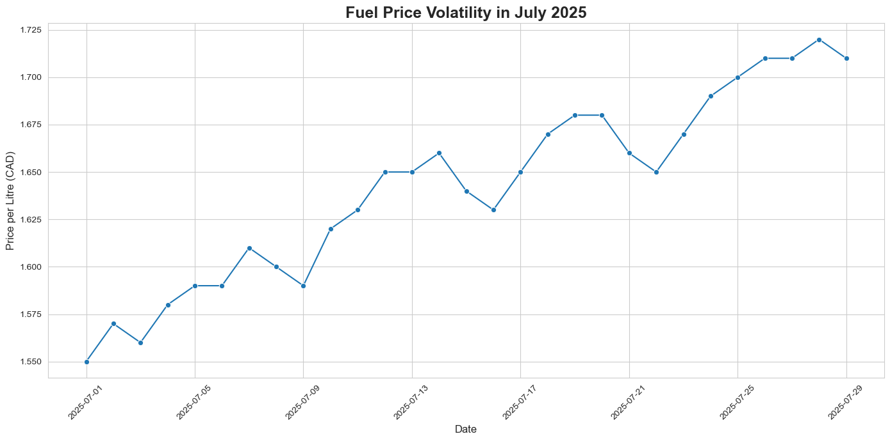
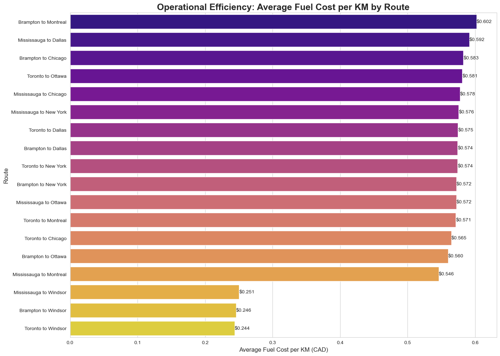
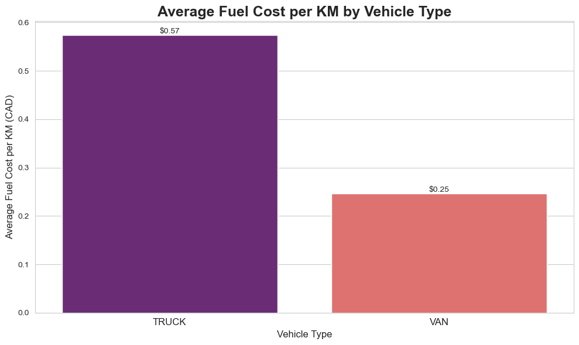

<h1>XYZ Logistics Inc. | Toronto Operations</h1>

Internal Memo: For Immediate Management Review

TO: Operations & Finance Management

FROM: Kevin Yuan, Business & Data Analyst, Toronto

SUBJECT: Final Analysis: Mitigating Risk from Fuel Volatility and Lane Inefficiencies

<h2>Executive Summary</h2>

This analysis of July 2025 data reveals a critical business risk driven by a combination of external market pressure and internal operational inefficiencies. Fuel prices in the GTA rose by over 10% in July, exposing vulnerabilities in our network. This market volatility disproportionately impacts our least efficient lanes, particularly the Brampton to Montreal route, which operates at an abnormally high $0.602/km. This report recommends immediate actions to address this specific inefficiency hotspot, optimize our fleet, and explore financial instruments to hedge against further market shocks.

<h3 class="section-title">Context: A Volatile and Rising Fuel Market</h3>
The primary driver of risk in July was the external market. Diesel prices in the Greater Toronto Area showed a consistent upward trend, increasing our baseline costs and making every operational inefficiency more costly.

Figure 1: Daily average price of diesel in Ontario for July 2025.

<h3 class="section-title">Finding 1: The Brampton-Montreal Lane Inefficiency Hotspot</h3>
The rising market prices magnify the impact of our least efficient lanes. By analyzing fuel cost per kilometer, the data shows the Brampton-Montreal route is a significant operational outlier, costing more per kilometer than even our longest cross-border routes.

Figure 2: The Brampton-Montreal lane stands out as our most inefficient route based on July data.

<h3 class="section-title">Finding 2: The Underlying Cause—Our Fleet Efficiency Gap</h3>
This specific route issue is amplified by a fundamental challenge in our fleet composition. Our trucks are inherently more than twice as expensive to operate per kilometer as our vans, making any inefficiency on truck-dominated routes significantly more impactful to our bottom line.

Figure 3: The operational cost gap between Trucks and Vans is the primary driver of high per-kilometer costs.

<h3 class="section-title">Actionable Recommendations</h3>

Based on this comprehensive analysis, the following actions are recommended for immediate implementation:

Launch an "Efficiency Audit" on the Brampton-Montreal Lane: We must immediately determine why this specific route is an outlier. I recommend tasking a logistics coordinator with a two-week audit of this lane, focusing on vehicle assignment, route optimization software performance, and driver metrics.

Mitigate Market Risk via Financial Hedging: Given the clear price volatility shown in Figure 1, we must engage the finance department to evaluate fuel hedging strategies for Q4 2025. Locking in prices for a portion of our consumption will insulate our budget from further market shocks.

Initiate a Fleet "Right-Sizing" Program: The data in Figure 3 proves our vans are dramatically more efficient. We should immediately identify all freight on shorter domestic routes (e.g., Toronto-Ottawa, Toronto-Windsor) that could be shifted from trucks to vans to lower our fleet's overall average cost per kilometer.

For a complete breakdown of the methodology, data cleaning steps, and Python code, please refer to the <a href="https://github.com/Kevin-yyuan/fuel_analysis.git" target="_blank">full analysis in the project's Jupyter Notebook on Github</a>.

